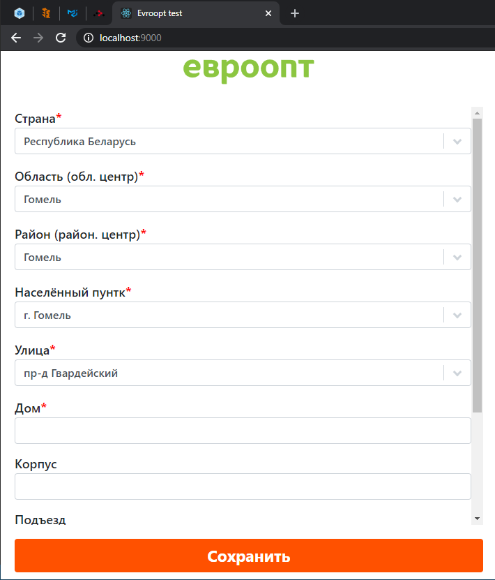
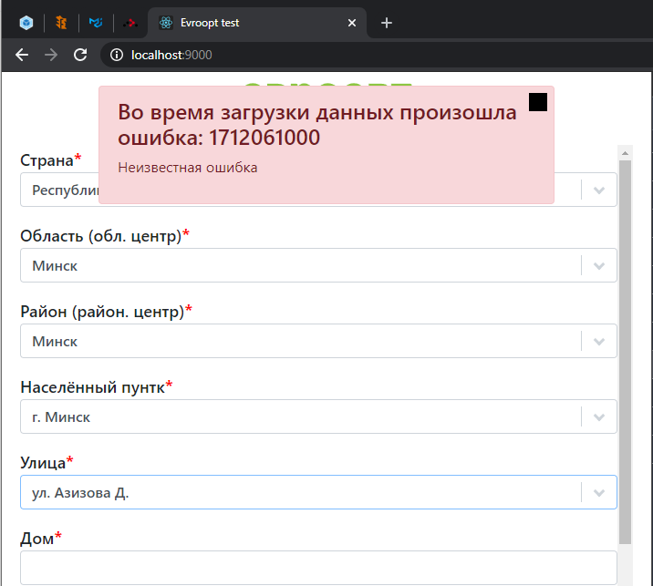

# ЕВРООПТ тестовое задание

!!Не разобрался с Combo контролкой в bootstrap с выбором по умолчанию первого. 
Логика с выбором первого самостоятельно при наличии только одного элемента в списке работает.
Но в списке в качестве выбранного отображет первое значение, хотя это не так.

Результаты:

1. "Рисунок 1" - работоспособность приложения;
1. "Рисунок 2" - сообщение об ошибке (на чёрный квадратик слева оно закрывается);

